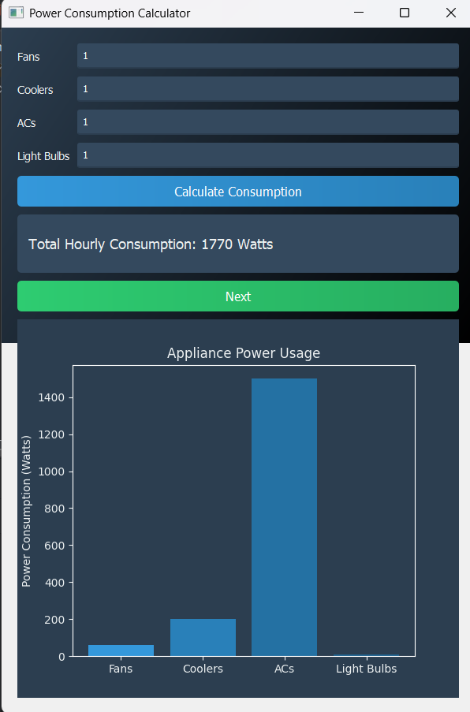
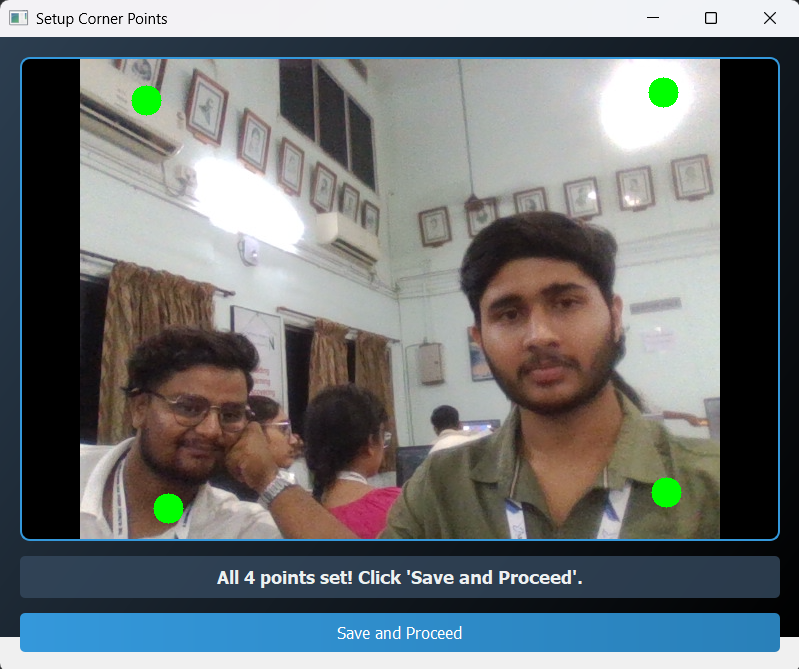
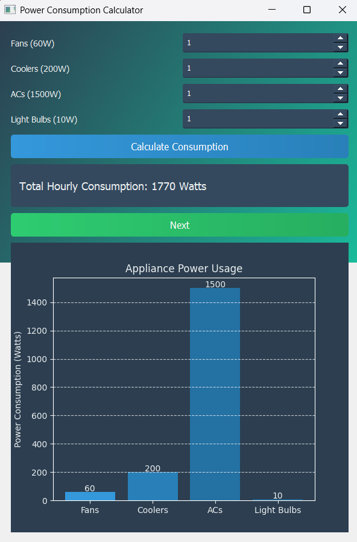
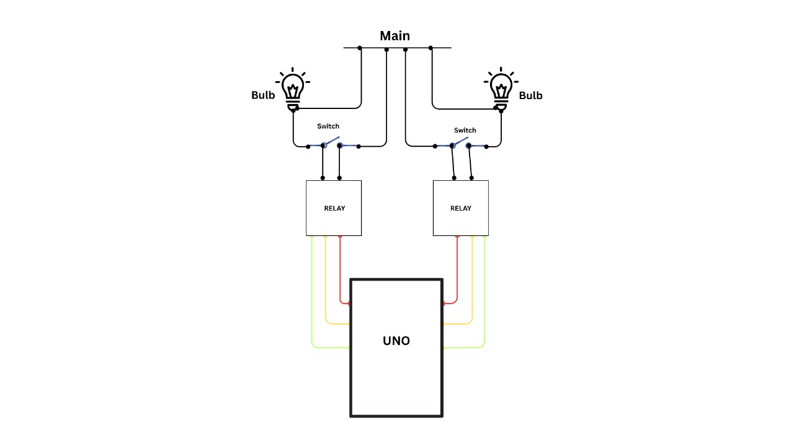
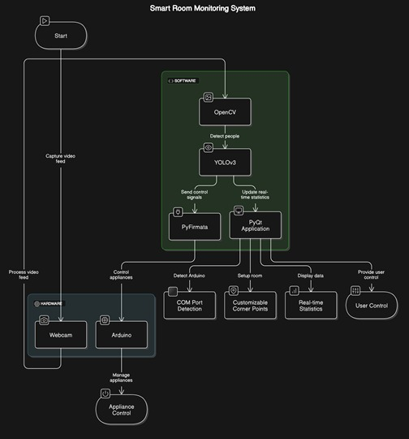

# 🔌 Automated Power Monitoring System  
### 🚀 Developed by Team Backend Battalion

---

## 📍 Problem Statement

Energy inefficiency due to unattended electrical appliances in unoccupied rooms remains a significant issue in both residential and commercial environments. Manual monitoring and control of these appliances are often impractical, leading to excessive electricity consumption and increased carbon footprint.

> 💡 **Insight**: Existing solutions are either manual or lack real-time feedback and intelligent automation.

---

## 🌟 Our Solution

We propose an **Automated power Monitoring System** that leverages **real-time computer vision** and **IoT integration** to automate appliance control. Using a webcam, the system detects human presence through **YOLOv3**, communicating with an **Arduino** to intelligently manage appliances.

---

## 🔧 Features at a Glance

- 👁️‍🗨️ Real-time people detection using YOLOv3
- 🖥️ Interactive GUI with PyQt for control & monitoring
- ⚙️ Dual operation modes – Manual & Automatic
- 🔌 Smart appliance control via Arduino + Relays
- 📊 Live electricity usage stats and savings tracker
- 🔍 Auto-detection of serial COM ports
- 🖼️ Customizable room layout for area mapping

---

## 🧠 Tech Stack

| Layer             | Technology                          |
|------------------|--------------------------------------|
| 🧠 AI Engine      | YOLOv3 (Real-time Object Detection)  |
| 🎥 Image Capture  | OpenCV                              |
| 🖥️ Interface      | PyQt (Desktop GUI)                   |
| 🔌 Hardware Control | PyFirmata + Arduino UNO + Relays    |
| 📹 Devices         | Webcam, Electrical Relays            |

---

## 🌍 Impact

### 🔋 Environmental
- Reduces power wastage
- Supports **SDG 7**: Affordable & Clean Energy

### 💰 Economic
- Cuts electricity costs
- Aligns with **SDG 12**: Responsible Consumption

### 👥 Social
- Promotes smart living and convenience
- Encourages sustainable innovation (**SDG 9**)

---


### 📸GUI 


- UI 1




UI 2




UI 3




## 📈 Scalability

- 🏠 Homes
- 🏢 Offices
- 🏫 Schools
- 🛍️ Commercial Complexes

---

## 🔮 Future Scope

- ☁️ Cloud-based dashboard for remote analytics
- 📱 Mobile app for appliance control
- 🌡️ Advanced sensors: temperature, humidity, etc.
- 🧠 Enhanced AI with multi-person detection & behavior analysis

---

## ⚙️ System Workflow

1. Webcam captures real-time video
2. YOLOv3 identifies human presence in frames
3. GUI updates status and control options
4. Signals are transmitted to Arduino via PyFirmata
5. Appliances are switched on/off accordingly

---

## 🔌 Circuit Diagram



---

## 🧠 System Interface



---

## 📁 Project Directory

```
smart-room-monitoring/
├── .gitattributes
├── Automatic_com_port_Detection.py      # Arduino port detection
├── Raw_Code.py                          # Testing file
├── UI.py                                # UI interface
├── coco.names                           # YOLO class labels
├── ele_consumption_cal.py               # Electricity consumption calculator
├── main.py                              # Binder / integration script
├── readme.md                            # Project readme
├── yolov3.cfg                           # YOLOv3 config
└── yolov3.weights                       # YOLOv3 weights

```

## 👨‍💻 Team Backend Battalion

| Name                  | Role                                |
|-----------------------|-------------------------------------|
| 🧠 Shri Ram Dwivedi    | AI Model Integration               |
| ⚡ Amaya Kumar Sahu    | Arduino & Hardware Logic           |
| 💻 Surya K. Srivastave| PyQt Interface & Integration       |
| 🎨 Ananya Shahi        | UI/UX Design + Documentation       |


> 🌱 *Join us in revolutionizing how we consume energy—one smart room at a time.*

---
